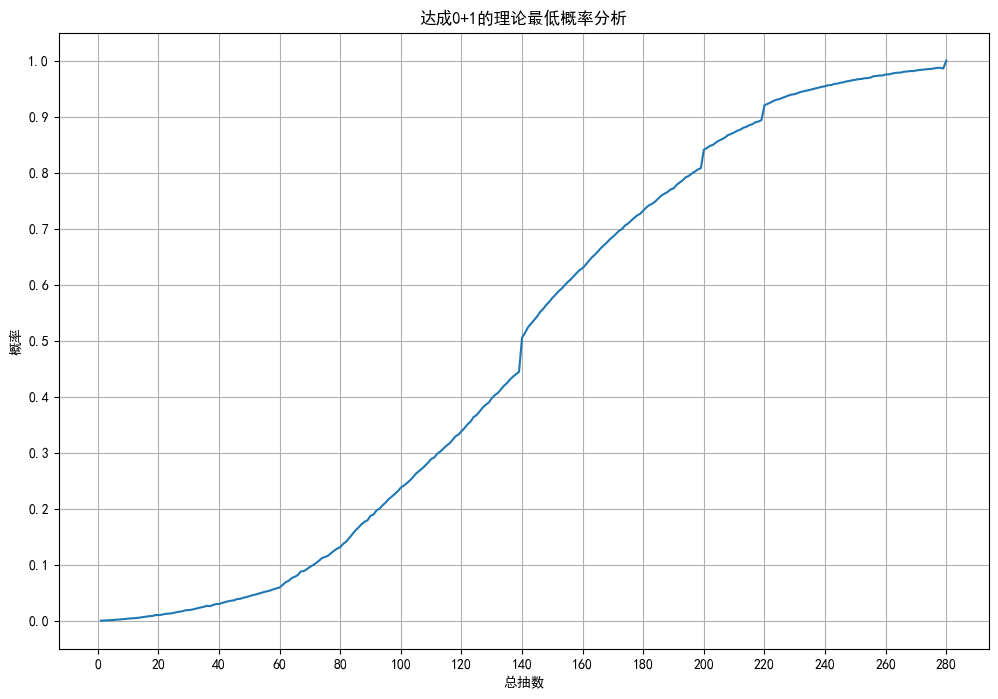

# 尘白禁区卡池概率计算

由于目前官方未公开详细卡池概率，本项目为最坏情况下的概率分析。并不保证准确，过程及结果仅供参考。

| 目标概率 | 最低总抽数 |
|---------|-----------|
| 0.50    | 141       |
| 0.60    | 157       |
| 0.70    | 176       |
| 0.80    | 200       |
| 0.90    | 220       |
| 0.95    | 239       |
| 0.98    | 269       |
| 0.99    | 280       |

